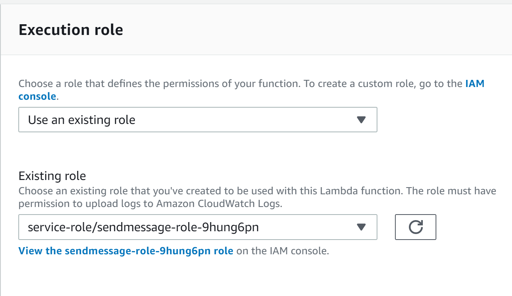
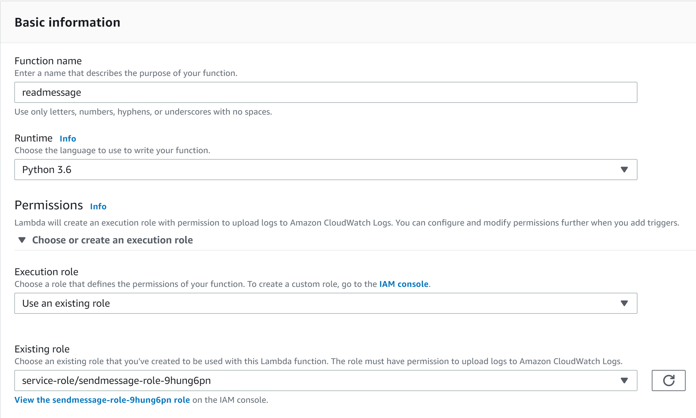
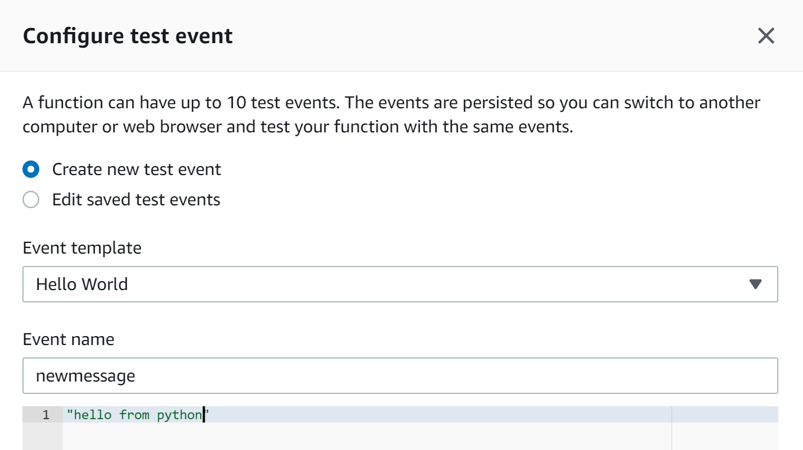
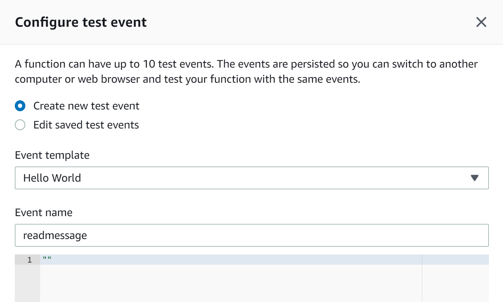

## Test Amazon SQS using AWS Lambda

### 1. Create an Amazon SQS queue
1. Login to AWS console - https://console.aws.amazon.com
2. Type **SQS** in the Services search box and select **Amazon SQS**
3. On the **SQS** console home, click **Create New Queue**
4. Enter **LabQueue.fifo** in the **Queue Name** textbox. 
5. Select **FIFO Queue** under **What type of queue do you need?
6. Scroll down and click **Quick-Create Queue**
7. Your queue is not successfully created.
8. Copy the **URL** from the **Details** tab at the bottom of the screen and save it in a text editor. We will use this URL in the Lambda function we will create later.

### 2. Create a Python based Lambda function to send messages to SQS
1. Navigate to AWS Lambda 
2. Click on **Create function**
3. Select **Author from scratch**
4. Name the funcion as **sendmessage**
5. Select **Python 3.6** as the runtime
6. Click **Create function**
7. Replace the default code with the code in the block below

```python
import json
import boto3

def lambda_handler(event, context):

    sqs_queue_url="https://sqs.us-east-1.amazonaws.com/831210339789/LabQueue.fifo"
    
    sqs_client = boto3.client('sqs')
   
    msg = sqs_client.send_message(QueueUrl=sqs_queue_url,MessageBody=event,MessageGroupId='mygroup',MessageDeduplicationId='dedupeID',
)
```
8. Replace **<QUEUE_URL>** with the URL you saved into the text editor earlier
9. Click on **Save** at the top of the screen to save the code changes you just made.
9. Scroll down to the **Execution role** section on the Lambda console. You will see that a new IAM Role has been created for the Lambda function with some basic permissions as shown in the screenshot below.

10. For the Lambda function to be able to send messages to the SQS queue, it needs to have necessary permissions. Click on **View the sendmessage-role-...** link which will open a new tab and take you to the IAM console. 
11. Click on **Attach policies**
12. Type **sqs** in the search textbox and select **AmazonSQSFullAccess** policy checkbox
13. Click **Attach policy**. Once the policy is saved, close the browser tab.

### 3. Create a Python based Lambda function to read messages from the Queue

1. Navigate to **AWS Lambda** console and click **Create function**
2. Name the function as **readmessage**
3. Select **Python 3.6** as the runtime
4. Expand **Choose or create an execution role** by clicking on it
5. Select **Use an existing role** under **Execution role** section
6. Select the same role you created earlier for the **sendmessage** lambda function. See screenshot below for details

7. Click **Create function**
8. Replace the default code with the code below
``` python
import json
import boto3

def lambda_handler(event, context):
# Retrieve messages from an SQS queue
    sqs_queue_url = "<QUEUE_URL>"
    sqs_client = boto3.client('sqs')

    msgs = sqs_client.receive_message(QueueUrl=sqs_queue_url)
            
    print(msgs)
```
9. Replace **<QUEUE_URL>** with the URL of the queue you created earlier in the exercise

### Test everything
#### Send message to the SQS queue
1. Navigate to the **sendmessage** Lambda function page
2. Click on the drop down near the **Test** button at the top right and select **Configure test events**
3. In the new popup, select **Create new test event**
4. Select **Hello World** template.
5. Name the event as **newmessage**
6. Clear the textbox with sample inpute json and enter any string within quotes. See screenshot below for details

7. Click **Save** at the bottom of the screen
8. Simply click on the **Test** button on the **sendmessage** Lambda function home page to send the message to SQS
9. You should see the user interface saying **Execution result:succeeded**. Click on it to see details of the execution. 

#### Check the message in SQS queue
1. Navigate to Amazon SQS home page and select **LabQueue.info**
2. Click on **Queue Actions** and select **View/Delete Messages**. Click **Start Polling for Messages**
3. You should be able to see the message that you just sent from the Lambda function.

#### Read the message from the SQS queue
1. Navigate to the **readmessage** Lambda function page
2. Click on the drop down near the **Test** button at the top right and select **Configure test events**
3. In the new popup, select **Create new test event**
4. Select **Hello World** template.
5. Name the event as **readmessage**
6. Clear the textbox with sample inpute json and replace it with empty quotes

7. Click **Save** at the bottom of the screen
8. Simply click on the **Test** button on the **readmessage** Lambda function home page to send the message to SQS
9. You should see the user interface saying **Execution result:succeeded**. Expanding it will show the details of the execution along with the content of the SQS message in the **Log output** section.


